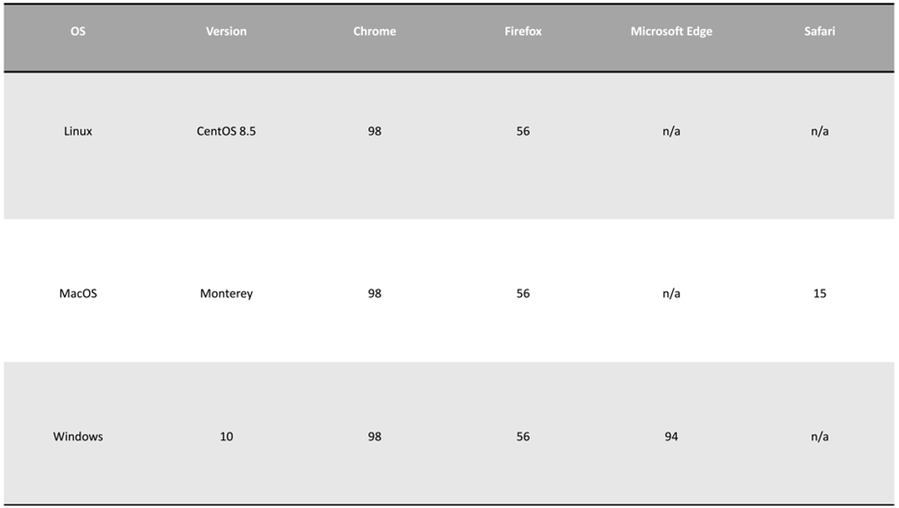

# 1.1. Cross-Species Transmissibility Analyzer  (CROSTA)
Pathogen cross-species transmission is a major health threat, facilitated by adaptive substitutions in proteins that allow pathogen entry. Comparative analysis of sequence changes between the pathogen population (within a donor reservoir or environmental opportunistic) and that in the recipient host can enable identification of substitutions that are evolutionarily selected for the latter. Herein, we present CROSTA, a tool that compares protein/DNA sequence of two co-aligned pathogen populations and are analyzed for cross-species transmission. The distinct sequences at each aligned overlapping user-defined k-mer positions are categorized as diversity motifs based on their incidences. The index motif is the predominant sequence, major variant is the second most common, while minor variants are those in-between major and unique variants (singletons). CROSTA provides the incidences of the diversity motifs with built-in transmission analyses enhanced by metadata enrichment. Application of CROSTA is demonstrated with zoonosis analysis of SARS-CoV-2 and the tool is available at [https://crosta.bioinfo.perdanauniversity.edu.my](https://crosta.bioinfo.perdanauniversity.edu.my).

# 1.2. Accesibility

The webserver is publicly available at:
https://crosta.bioinfo.perdanauniversity.edu.my

# 1.3. Browser compatibility



# 1.4. Frontend/Backend Frameworks

Python 3.9 is utilized for the CROSTA webserver backend. ReactJS framework utilized for CROSTA webserver frontend. 

# 1.5. Workflow

(Figure-1)=
```{image} images/workflow.svg
:alt: workflow
:class: bg-primary
:width: 600px
:align: center
```

<a></a> 
: **Figure 1. Workflow schema.** 
(section-two)=

(Figure-2)=
```{image} images/diversity_motifs.svg
:alt: diversitymotifs
:class: bg-primary
:width: 300px
:align: center
```

<a></a> 
: **Figure 2. Definitions of diversity motifs.** The ‘‘Index’’ nonamer is the most prevalent sequence, present in 8 of the 20 isolates. The ‘‘Major’’ variant is the most common variant of the index (5/20). ‘‘Minor’’ variants are multiple different repeated sequences, each with incidences less than the major variant. ‘‘Unique’’ variants are those represented by a single aligned sequence. Distinct variant sequences at a given nonamer position are the different sequence at the position; in this example one of major, two of minor, and three of unique.
(section-two)=